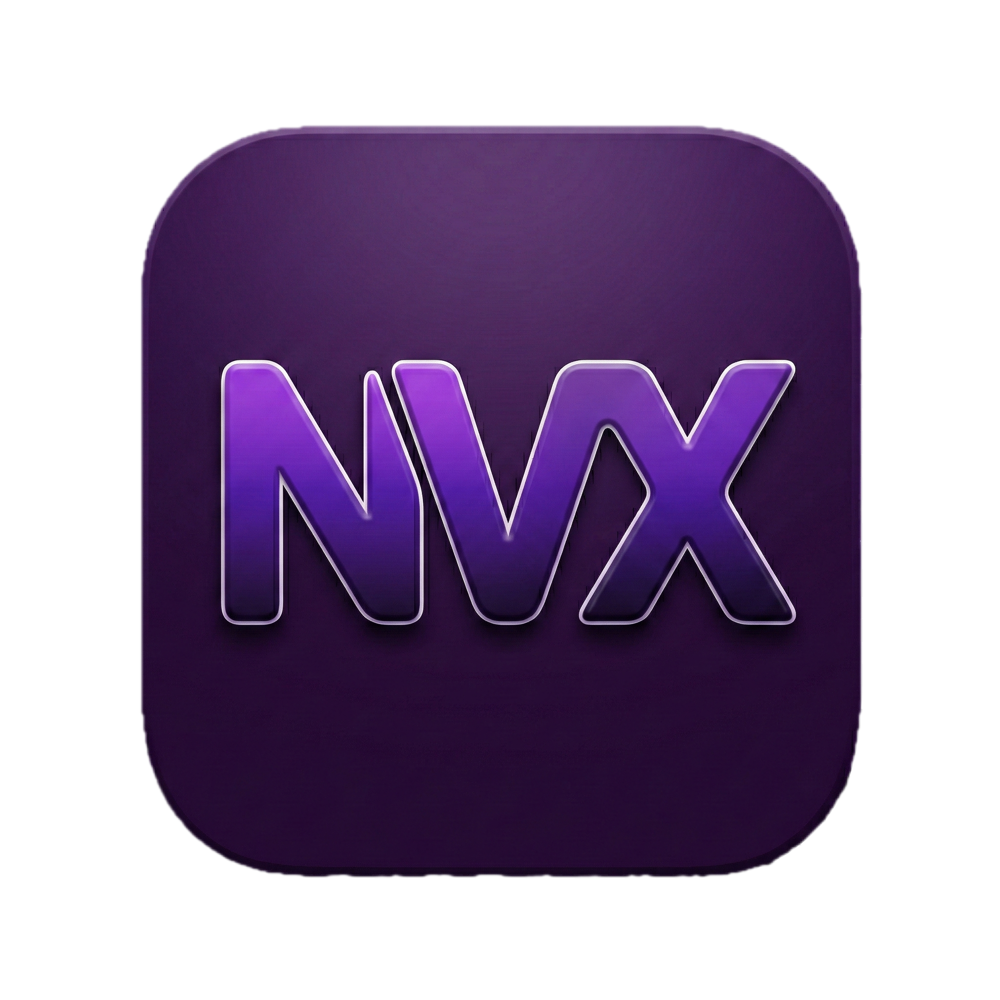

# NicVox 🎙️

A native macOS Menu Bar application that converts speech to text and automatically pastes it into your active window (Terminal, Editor, Browser, etc.). Designed for speed and developer productivity.

<p align="center">
  
</p>

## 🚀 Quick Install

Open your Terminal and run this command:

```bash
curl -sL https://raw.githubusercontent.com/nicolaregattieri/nicvox/main/setup.sh | bash
```

That's it! The app will be installed to your `/Applications` folder and opened automatically.

## ✨ Features

*   **Global Shortcuts:** Trigger recording from anywhere.
*   **Dual Language:** Instantly switch between Portuguese (🇧🇷) and English (🇺🇸).
*   **Auto-Paste:** Automatically simulates `Cmd+V` to paste the transcribed text into your active app (requires Accessibility permission).
*   **Audio Feedback:** Customizable sounds for Start/Stop recording.
*   **Native & Fast:** Uses Apple's on-device `SFSpeechRecognizer` (no API keys required).
*   **Privacy First:** No audio is sent to third-party servers (besides Apple's processing).

## 🎮 Usage

| Shortcut | Action |
| :--- | :--- |
| **Cmd + Option + P** | Start recording in **Portuguese** 🇧🇷 |
| **Cmd + Option + E** | Start recording in **English** 🇺🇸 |
| **(Press Again)** | Stop recording & Paste |

*Shortcuts and sounds can be customized in the **Preferences** menu.*

## 🛠️ Build from Source

If you prefer to build it yourself:

1.  Clone the repo:
    ```bash
    git clone https://github.com/nicolaregattieri/nicvox.git
    cd nicvox
    ```
2.  Run the installer:
    ```bash
    ./install.sh
    ```
3.  Generate DMG (Optional):
    ```bash
    ./create_dmg.sh
    ```

## 📄 License

MIT License. Built with Swift and SwiftUI.